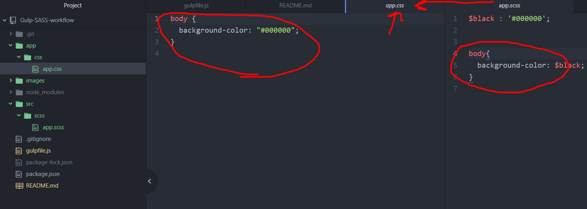
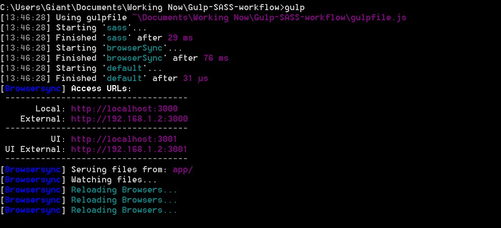
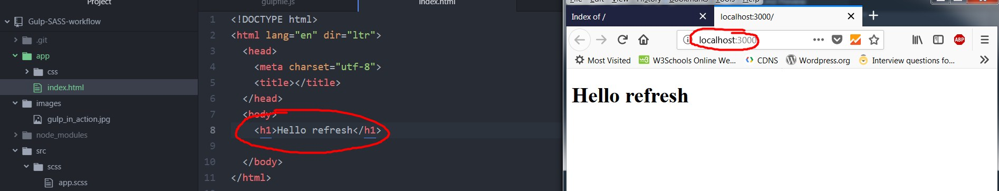

# Gulp-SASS-workflow
This is a project that uses NPM, Gulp and SASS so we can optimize our workflow. It will help new developers to learn to work with these tools.

##### Requirements : Very good level in HTML and CSS, basic understanding of javascript

Gulp is a tool that helps with workflow automation since it does a lot of tasks for us like minification, concatenation, browser refresh when we have changes and many more... The general idea is that gulp has tasks and each task does something for us automatically...

SASS is a preprocessor that makes CSS really powerful since you can have variables, mixin, partial, nesting, arguments, create grid responsive layouts and other cool stuff that will improve your CSS code amazingly.

<h6>In our project, gulpfile.js controls gulp tasks and package.json has all our dependencies</h6>

## Table of contents

- [Installation and starting](#installation-and-starting)
- [Our first task](#first-task-sass-compiler)
- [Browser-sync](#installing-browser-sync-and-Creating-Gulp-Task)
- [AutoPrefixer](#autoprefixer)
- [Copying and removing files](#copying-files)
- [Concatenating javascript](#concatenating-javascript-files-to-one-file)
- [Browserify-Bootstrap-Mustache-jQuery](#Browserify-Bootstrap-Mustache-jQuery)
- [Mustache](#mustache)
- [Image minification](#image-minification)
- [HTML partials](#html-partials)

## Installation and starting

First we install git so we can monitor our project's version :

 https://git-scm.com/download/win

 Then we install node.js :

https://nodejs.org/en/

We can check version of node by typing in command prompt :

<code>node -v</code>

Package manager version in command prompt

<code>npm -v</code>

Then to install gulp we type :

<code>npm install -g gulp</code>

We create a new repository to github.com with our account and then we clone.

Go to the directory you want to clone our repository with command prompt :

<code>git clone URL FROM OUR repository</code>

To create or reinitialize git :

<code>git init</code>

We need to create a package.json that will contain all our dependencies

<code>npm init</code>

We can easily install all packages we have in package.json with:

<code>npm install</code>

To start adding changes to your git (m stads for message) and add new files :

<code>git add .</code>

<code>git commit  -m "Add package.json"</code>

And we push the changes

<code>git push</code>

### Finally installing Gulp and SASS to our project

Install gulp and save dependencies to our project folder :

<code>npm install -save-dev gulp</code>

We can see in our package.json we have new dependanciesand a folder node-modules.

Install gulp-sass :

<code>npm install -save-dev gulp-sass</code>

By having package.json if we run npm install we will have all our packages again.

## First task SASS compiler

Create a js file that you will call the packages with require and control gulp tasks. For example in our project the file is called gulpfile.js. We must add our variable to our gulp file so we can use them where we want.

<pre><code>var gulp = require('gulp');
var sass = require('gulp-sass');
</code></pre>

We use task method and tell gulp where the source will be and the name of the task which is 'sass'. Gulp uses pipes which define what gulp will do. Explanation on pipes :

https://stackoverflow.com/questions/38404862/what-exactly-does-pipe-mean-in-gulp

The output style changes what css we will have. Expanded is normal,nested changes the curly brackets, compressed makes the css minified and compact puts each tag code in one line.
<pre>
<code>
gulp.task('sass', function(){
    return gulp.src('src/scss/app.scss')
      .pipe(sass({outputStyle : 'expanded'}).on('error',sass.logError))
      .pipe(gulp.dest('app/css'));
});
</code>
</pre>

Finally at command prompt we say gulp and the name of the task :

<pre>
<code>gulp sass
</code></pre>

We can see scss is compiled at css.

Later we can see we have a default task which simply runs with gulp command.

## Installing browser-sync and Creating Gulp Task

BrowserSync is a package that refreshes the page when it detects changes.

<pre><code>npm install --save-dev browser-sync
</code>
</pre>

BrowserSync also creates a server for us. Check gulpfile.js to see how it works.

We run gulp and we will see tasks running and server :

 We can see any changes we save to files we specified with autorefresh thanks to BrowserSync.

To make also css work we need to add a task and method watch. Again check gulpfile.js.

<pre><code>
gulp.task('watch', ['browserSync','sass'],function(){
    gulp.watch([SOURCE_PATHS.sassSource],['sass']);
  });
</code></pre>

We get now the changes made in css also.

## Autoprefixer

Autoprefixer is a package that automatically adds fixes fro browsers like -webkit, -moz etc.

<pre>
<code>npm install --save-dev gulp-autoprefixer
</code></pre>

Easily we add it to our sass task :

<pre><code>gulp.task('sass', function(){
    return gulp.src(SOURCE_PATHS.sassSource)//from
      .pipe(autoprefixer())
      .pipe(sass({outputStyle : 'expanded'}).on('error',sass.logError))
      .pipe(gulp.dest(APP_PATH.css));//to
});
</code></pre>

Note : Since most modern browsers don't have issues and support everything maybe you should add

<pre><code>.pipe(autoprefixer('last 10 versions'))
</code></pre>

## Copying files

We can copy files from one place to another by having a task for this:
<pre><code>gulp.task('copy',function(){
    gulp.src(SOURCE_PATHS.htmlSource)
    .pipe(gulp.dest(APP_PATH.root))
});
</code></pre>

And then watch a file and if it has changes run the copy task as we see in gulpfile.js. The use for this is to have the original file and the minified one.

## Gulp clean

Gulp clean is a package that checks if we have removed a file from src and removes it from destination.

<pre><code>npm install --save-dev gulp-clean
</code></pre>

<pre><code>
gulp.task('clean-html',function(){
    gulp.src(APP_PATH.root + '* .html')
    .pipe(gulp.dest(APP_PATH.root))
});
</code></pre>

Also to have deleted without restarting gulp we must add the task to our copy task.

## Concatenating javascript files to one file

With this package we can have multiple js files concatenated to one.
First in our console :
<pre><code>npm install --save-dev gulp-concat
</code></pre>

Then we use it like this :

<pre><code>gulp.task('scripts',['clean-scripts'], function(){
  gulp.src(SOURCE_PATHS.jsSource)
      .pipe(concat('main.js'))
      .pipe(gulp.dest(APP_PATH.js))
});
</code></pre>

## Browserify Bootstrap Mustache jQuery

Browserify is similar with npm but with more flexibility. The most common usage is to bundle packages in one file.

Mustache is a template system in Javascript. You use templates for dynamic data and you can load them without refreshing the browser.

Bootstrap is the ultimate library for building responsive projects. It also has many built in classes for buttons, modals, pop-ups, menus and more...

<pre><code>npm install --save-dev gulp-browserify mustache jquery bootstrap@3.3.7
</code></pre>

Don't forget to add to your gulpfile.

_Note : we will use bootstrap 3.3.7 as you can see in our above installment since bootstrap 4 uses different packages and css_

First we add browserify in our gulp file

<pre><code>var browserify = require('gulp-browserify');
</code></pre>

Then we pipe it :
<pre><code>//Copy javascripts file from src to app
gulp.task('scripts',['clean-scripts'], function(){
  gulp.src(SOURCE_PATHS.jsSource)
      .pipe(concat('main.js'))
      .pipe(browserify())
      .pipe(gulp.dest(APP_PATH.js))
});
</code></pre>

Finally a file scripts.js that will have all javascript into one thanks to browserify :

<pre><code>//Browserify syntax
global.jQuery = require('jquery'); //global function makes it top-level scope object (window)
bootstrap = require('bootstrap');
mustache = require('mustache');
</code></pre>

### Joining CSS AND SCSS to one file

First we install a package called merge-steam. This will allow to concatenate bootstrap with our css.

<pre><code>npm install --save-dev merge-stream
</code></pre>

Then in the task that handles our css which is the gulp.task('sass' ... in our gulpfile.js we merge and concat our scss and bootstrap to one.

### Bootstrap fonts

To add bootstrap fonts we need a separate task that will handle them.
To understand how we will do that :

...check commit "Add bootstrap fonts"

## Mustache

We have added mustache library as we saw above. Now we will see how it works by using the JSON file data.json. JSON files are files that have human understandable syntax and they contain raw data which we can fetch and do with them whatever we want.They usually consist of a key:value.  So in our script.js

<pre><code>//Get data from json and show them to template with mustache
jQuery(document).ready(function($){
  var jsonData =  $.getJSON('data.json',function(){

  }).done(function(data){
    var template = $('#template').html();
    var showTemplate = mustache.render(template,data)//where to what data
  });
});
</code></pre>

And to create the template in html :

<pre><code>&lt;div class="container">
    &lt;div class="row">
              &lt;div id="gallery" class="gallery">
                &lt;/div>
              &lt;script id="template" type="x-tmpl-mustache">
              {{#gallery}}
                &lt;div class="col-sm-6 col-md-4">
                  &lt;div class="thumbnail">
                    &lt;img src="img/{{image}}">
                  &lt;/div>
                  &lt;div class="caption">
                    &lt;h3 class="text-center">{{destiny}}</h3>
                  &lt;/div>
                &lt;/div>
              {{/gallery}}
              &lt;/script>
      &lt;/div>
&lt;/div>
</code></pre>

## Image minification

Image minification is really important. It makes pages load faster since they reduce
image size with minimal quality loss. Also this means better user experience since they will have your site/app loaded faster.

Gulp can do this automatically. First we will install gulp-newer which checks for those resource files that are newer than corresponding.
<pre><code>npm install --save-dev gulp-newer
</code></pre>

Then we install image-minification :

<pre><code>npm install --save-dev gulp-imagemin
</code></pre>

Add a task that will check for newer images and minify them :
<pre><code>
gulp.task('images',function(){
    return gulp.src(SOURCE_PATHS,imgSource)
    .pipe(newer(APP_PATH.img))
    .pipe(imagemin())
    .pipe(gulp.dest(APP_PATH.img));
});
</code></pre>

Check gulpfile.js for full code

## HTML partials

When we have repeating content and multiple html pages if we make one change for example in menu we must make the change to every html page. With backend languages like php or C# we can have these content only once and bring it where we want thanks to the backend language.

Gulp has the solution though for html pages as well and called gulp-inject-partials

<pre><code>
npm install --save-dev gulp-inject-partials
</code></pre>

We add the task :

<pre><code>
gulp.task('html',function(){
  return gulp.src(SOURCE_PATHS.htmlPartialSource)
  .pipe(injectPartials())
  .pipe(gulp.dest(APP_PATH.root))
})
</code></pre>

Then where you want to include the partial you write it as you can see in index.html whci looks like a comment but has the path and the partial.
